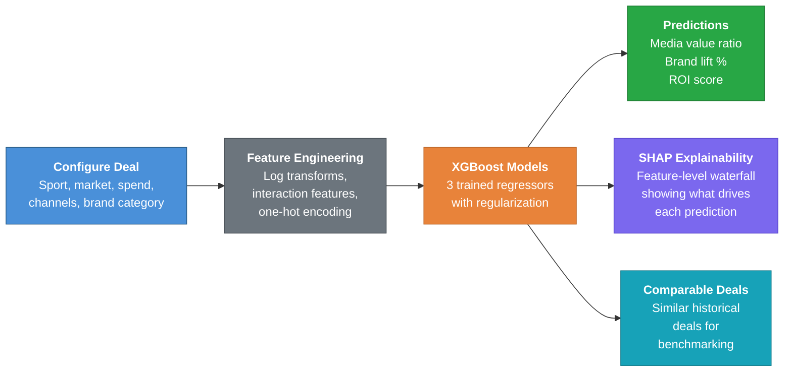
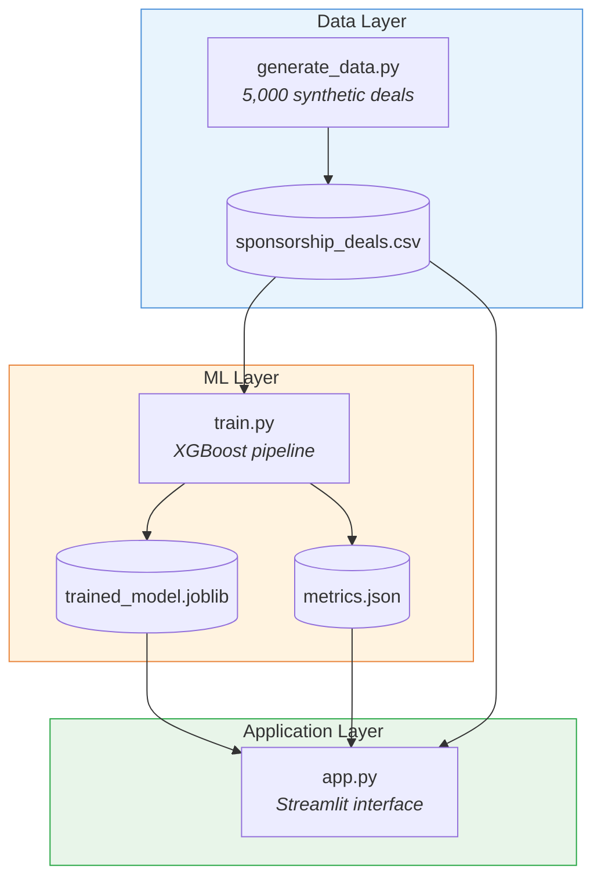

# Sports Sponsorship ROI Calculator

> **Predict the financial return of a sports sponsorship deal before you sign it.**


---

## What This Does

This is an **AI-powered calculator** that predicts three things about any sports sponsorship deal:

1. **Media Value** -- How much earned media exposure your dollars will generate
2. **Brand Lift** -- How much brand awareness will increase among fans
3. **ROI Score** -- An overall return-on-investment rating from 1 to 100

You enter the deal details (sport, market, spend, activation channels), and the model tells you what to expect -- along with a plain-English explanation of *why*.

---

## The Problem It Solves

Sports sponsorship is a **$65B+ global market**, and most deals are still evaluated with spreadsheets and gut instinct.

| Pain Point | Current Approach | This Tool |
|:-----------|:-----------------|:----------|
| "Will this deal deliver ROI?" | Gut feel + past experience | ML prediction based on 5,000 deal patterns |
| "What's driving the value?" | Opaque valuation models | SHAP explainability shows exactly which factors matter |
| "How does this compare?" | Manual comp research | Instant comparable deal lookup across 8 leagues and 10 markets |
| "How long does analysis take?" | Days of spreadsheet work | Seconds -- real-time interactive predictions |

---

## How It Works



---

## Key Metrics

The model was trained on 5,000 synthetic deals calibrated to IEG and Nielsen Sports benchmarks, then evaluated on a held-out 20% test set.

| Metric | Media Value Ratio | Brand Lift % | ROI Score | What It Means |
|:-------|:-----------------:|:------------:|:---------:|:--------------|
| **R-squared** | 0.686 | 0.718 | 0.784 | The model explains 69-78% of the variance in outcomes |
| **MAE** | 0.25 | 0.82 | 5.65 | Average prediction error is small relative to each scale |
| **MAPE** | 9.5% | 11.9% | 10.4% | Predictions are within ~10% of actual values on average |

---

## Features at a Glance

| Feature | Description |
|:--------|:------------|
| **Real-Time Predictions** | Adjust any deal parameter and see results update instantly |
| **SHAP Waterfall Charts** | Visual explanation of which factors push ROI up or down |
| **Comparable Deal Finder** | Automatically surfaces similar historical deals for context |
| **8 Leagues Covered** | NFL, NBA, MLB, MLS, NCAA, Tennis, Golf, Boxing/MMA |
| **10 Major Markets** | LA, New York, Chicago, Miami, Dallas, SF, Boston, Atlanta, Phoenix, Denver |
| **6 Deal Types** | Jersey patch, venue signage, broadcast, digital/social, experiential, naming rights |
| **5 Activation Channels** | On-air, digital, social, experiential, digital out-of-home |
| **Model Diagnostics** | Under-the-hood panel with residual analysis and feature importance |

---

## Tech Stack

| Layer | Technology | Why It Was Chosen |
|:------|:-----------|:------------------|
| **ML Model** | XGBoost | Industry-standard gradient boosting -- handles mixed feature types and captures nonlinear relationships |
| **Explainability** | SHAP | Game-theory-based feature attribution -- shows *why* the model made each prediction, not just *what* it predicted |
| **Frontend** | Streamlit | Turns Python into an interactive web app with zero frontend code |
| **Data Processing** | pandas, NumPy, scikit-learn | Feature engineering pipeline with log transforms, interaction features, and one-hot encoding |
| **Visualization** | matplotlib | Publication-quality charts for SHAP waterfalls, feature importance, and residual analysis |

---

## Quick Start

```bash
# 1. Install dependencies
pip install -r requirements.txt

# 2. Run the full pipeline (generate data, train model, launch app)
bash run.sh

# 3. Or skip to the app if data/model already exist
bash run.sh --app
```

The app opens at **http://localhost:8501**.

---

## Architecture



```
sponsorship-roi-calculator/
├── app.py                      # Streamlit web application
├── data/
│   ├── generate_data.py        # Synthetic data generator (5,000 deals)
│   └── sponsorship_deals.csv   # Generated dataset
├── model/
│   ├── train.py                # XGBoost training pipeline
│   ├── trained_model.joblib    # Saved model artifacts
│   └── metrics.json            # Evaluation metrics
├── run.sh                      # One-command pipeline script
├── requirements.txt            # Python dependencies
└── README.md
```

---

## Sample Output

When you configure a deal, the calculator returns three prediction cards plus an explanation.

**Example: NFL jersey patch deal in New York, $5M/year, 3-year term**

| Prediction | Value | Interpretation |
|:-----------|:-----:|:---------------|
| **Media Value Ratio** | 3.1x | Every $1 spent generates ~$3.10 in earned media value |
| **Brand Lift** | 7.2% | Expected brand awareness increase among the target audience |
| **ROI Score** | 72 / 100 | Excellent -- top quartile among comparable deals |

The SHAP waterfall chart then shows *exactly why* -- for instance, that NFL in New York drives the prediction up, while a shorter deal length or missing activation channels would pull it down.

---

## Why This Matters for Sales Teams

**For partnership sellers:** Stop guessing. Walk into a pitch with AI-backed projections that show a prospect exactly what their deal will deliver -- media value, brand lift, and ROI -- before they commit a dollar.

**For brand buyers:** Compare deals across leagues, markets, and activation strategies using data, not decks. Know which deal structure maximizes your return before the negotiation starts.

**For leadership:** Replace subjective deal scoring with a quantitative framework. Evaluate pipeline quality with consistent, explainable metrics instead of one-off analyses.

---

## About the Author

**CJ Fleming** -- Revenue leader with 15+ years in media partnerships and a Columbia University AI certification. This project demonstrates what happens when deep sales domain expertise meets machine learning engineering: tools that solve real business problems, not just academic exercises.

The sponsorship economics in this model -- deal structures, media multipliers, activation strategies, league-by-market dynamics -- come from years of negotiating these deals firsthand.

[](https://www.linkedin.com/in/cjfleming/)
[](https://github.com/cjf-iii)
